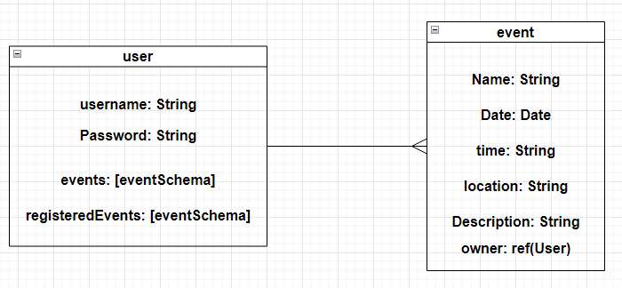

# Event Management System

### Date: 28/7/2024

### By: Ahmed Darwish

#### [GitHub](https://github.com/AhmedAslw) | [LinkedIn](https://www.linkedin.com/in/ahmed-darwish-056b3a235/)

---

### **_Description_**

#### Event Management System (EMS) is a digital tool that streamlines the planning, organization, and execution of events

---

### Technologies Used

- HTML
- CSS
- JAVASCRIPT (Node.js, EJS-powered)

---

### User Story

1. User can create a new event and provide details such as the event name, date, time, location, and description.
2. User can view the community page and register for an event.
3. User can view registered event details.

> ### Project on Github: [here](https://github.com/AhmedAshlw/Event-Management-System/tree/main)

---

### Entity–Relationship Model (ERD)

---

### Screenshots

#### Home-Page

#### Signin-Page

#### Signup-Page

#### Events-Page

#### Add-Event-Page

#### Edit-Event-Page

#### Community-Page-Page

#### Community-Show-Event-Page

---

### Future Enhancements

1. Add public and private events
2. Add tickets to events
3. Make it responsive on Tablet and Mobile views

---

### External Resources

Home page image [click me](https://stock.adobe.com/search?k=calendar+cartoon)

Figma for Wireframes [click me](https://www.figma.com/design/VwstBzU06WNahzim77dsWw/Event-Management-System-Wireframes?node-id=0-1&t=6IPHBtMzkPD4bWEr-1)

---
